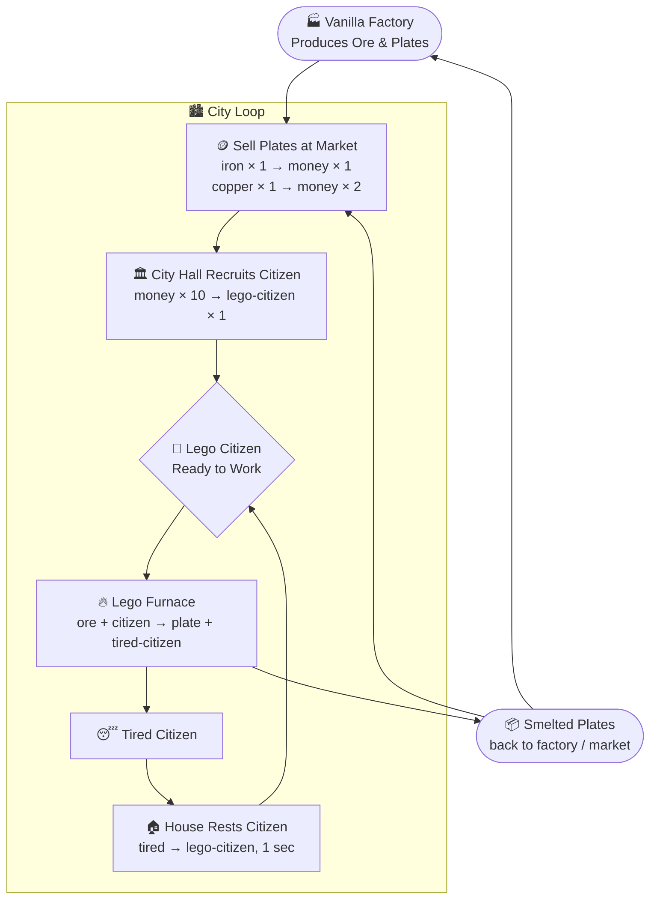
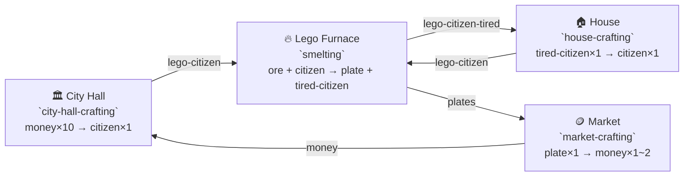
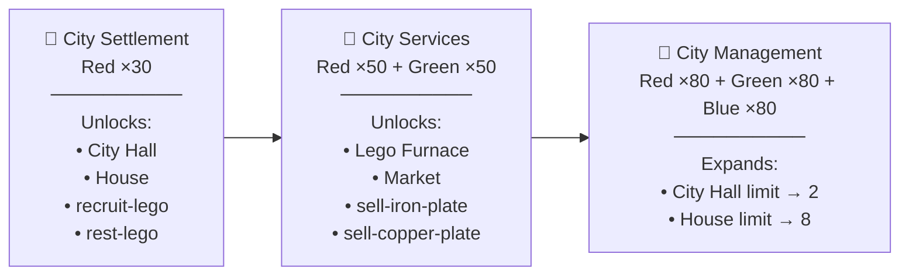
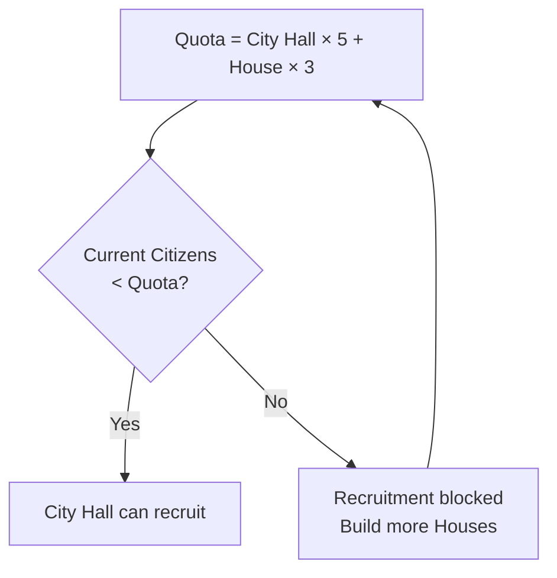
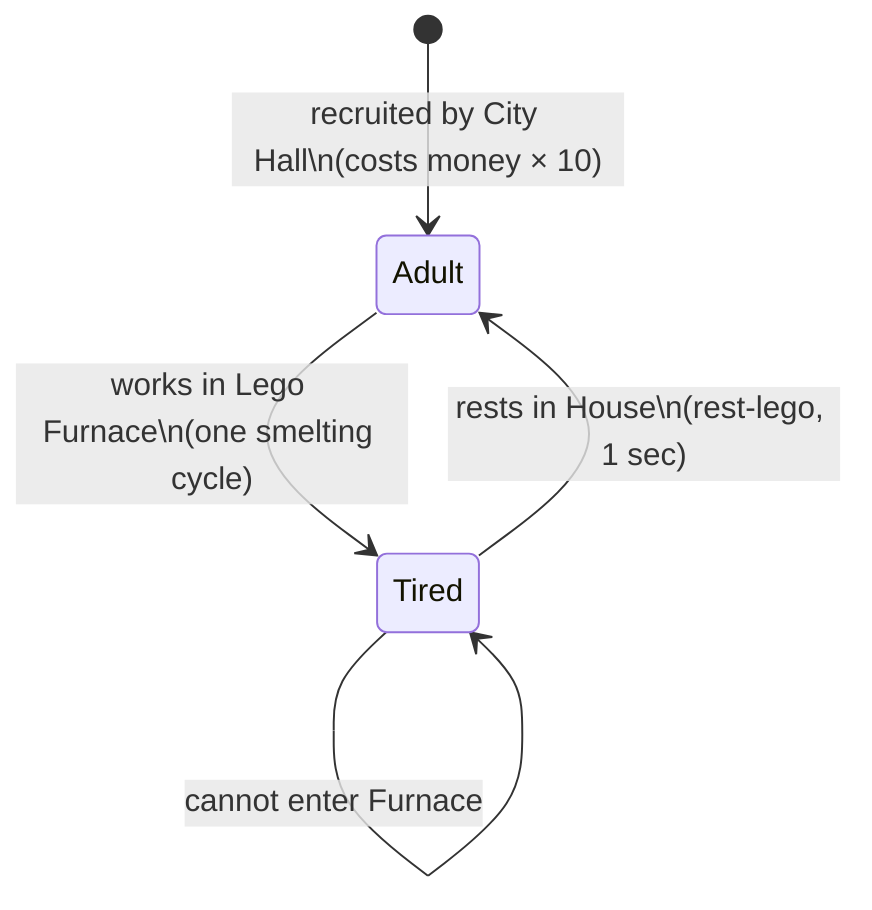

# Lego City — Game Loop

## Core Loop Overview

```mermaid
flowchart TD
    A([🏭 Vanilla Factory\nProduces Ore & Plates]) --> B

    subgraph CITY ["🏙️ City Loop"]
        B[🪙 Sell Plates at Market\niron × 1 → money × 1\ncopper × 1 → money × 2]
        B --> C[🏛️ City Hall Recruits Citizen\nmoney × 10 → lego-citizen × 1]
        C --> D{👷 Lego Citizen\nReady to Work}
        D --> E[🔥 Lego Furnace\nore + citizen → plate + tired-citizen]
        E --> F[😴 Tired Citizen]
        F --> G[🏠 House Rests Citizen\ntired → lego-citizen, 1 sec]
        G --> D
    end

    E --> H([📦 Smelted Plates\nback to factory / market])
    H --> A
    H --> B
```

---

## Buildings & Their Single Responsibility

```mermaid
flowchart LR
    CH["🏛️ City Hall\n`city-hall-crafting`\nmoney×10 → citizen×1"]
    HO["🏠 House\n`house-crafting`\ntired-citizen×1 → citizen×1"]
    LF["🔥 Lego Furnace\n`smelting`\nore + citizen → plate + tired-citizen"]
    MK["🪙 Market\n`market-crafting`\nplate×1 → money×1~2"]

    MK -->|money| CH
    CH -->|lego-citizen| LF
    LF -->|lego-citizen-tired| HO
    HO -->|lego-citizen| LF
    LF -->|plates| MK
```

---

## Technology Unlock Path

```mermaid
flowchart LR
    T1["🔬 City Settlement\nRed ×30\n──────────\nUnlocks:\n• City Hall\n• House\n• recruit-lego\n• rest-lego"]
    T2["🔬 City Services\nRed ×50 + Green ×50\n──────────\nUnlocks:\n• Lego Furnace\n• Market\n• sell-iron-plate\n• sell-copper-plate"]
    T3["🔬 City Management\nRed ×80 + Green ×80 + Blue ×80\n──────────\nExpands:\n• City Hall limit → 2\n• House limit → 8"]

    T1 --> T2 --> T3
```

---

## Population Quota

```mermaid
flowchart TD
    Q["Quota = City Hall × 5 + House × 3"]
    Q --> CK{Current Citizens\n< Quota?}
    CK -- Yes --> R[City Hall can recruit]
    CK -- No --> B[Recruitment blocked\nBuild more Houses]
    B --> Q
```

---

## Citizen State Machine

```mermaid
stateDiagram-v2
    [*] --> Adult : recruited by City Hall\n(costs money × 10)
    Adult --> Tired : works in Lego Furnace\n(one smelting cycle)
    Tired --> Adult : rests in House\n(rest-lego, 1 sec)
    Tired --> Tired : cannot enter Furnace
```
